# LLM Exploration: Beyond Benchmarks

Deep exploration of local LLM internals — activations, representation geometry, dynamic stability, and ecosystem dynamics. This research goes beyond benchmark scores to understand **how models actually work** at the mathematical level.

## Core Findings

### 1. Representation Geometry: The 5.3x Dimensionality Gap
SSM models (Mamba) use **5.3x higher intrinsic dimensionality** than Transformers (p=1.08e-40). Hybrids are genuinely intermediate — not just a sum of parts.

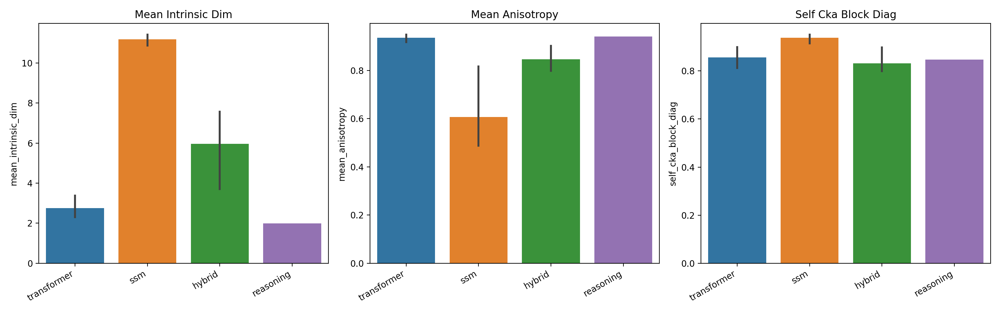

### 2. Universal Reasoning Compression
**6/6 matched reasoning-base pairs** show PR compression (Wilcoxon p=0.016). Reasoning training universally compresses representations regardless of method — distillation, RL, or SFT.

### 3. Over-Compression is Real
DSR1-1.5B **improves from 37.5% to 50.0% accuracy** when its representations are mildly expanded — evidence it has been compressed below optimal dimensionality.

### 4. Pressure-Proof vs Glass Cannon
Models react dramatically differently to hidden-state noise:
- **Gemma2-2B**: Pressure-proof (AUC=0.018) — barely affected by perturbation
- **Gemma3-1B**: Glass cannon (AUC=0.924) — collapses under minimal noise
- **Hybrids are most robust** (mean AUC=0.173), SSMs least (0.830)
- **Math is more fragile than factual recall** (Wilcoxon p=0.008)

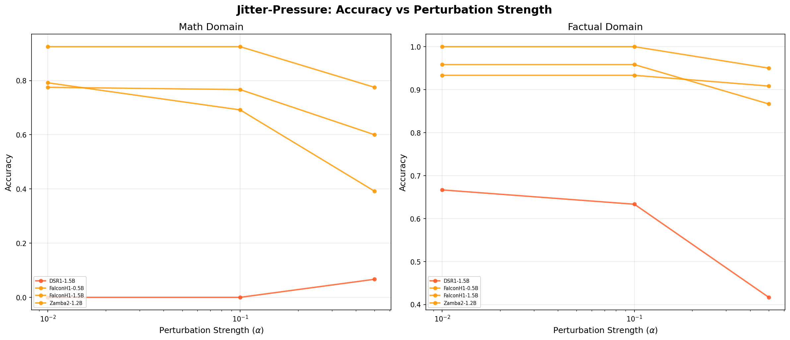
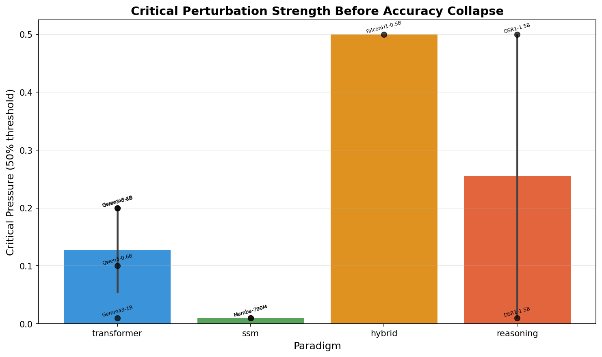

### 5. Orthogonal Axes — With a Scale-Dependent Twist
At sub-3B scale: PR surgery and jitter stress show **no interaction** (exp-012: OR=1.10, ROPE=0.998; exp-013: OR=1.02, 46,656 trials). At **7B+ scale**: interaction emerges (exp-014: OR=0.92, p=0.013) — but it's **transformer-specific** (exp-015: transformers=-0.023, reasoning=0.000). Cochran's Q shows no between-model heterogeneity (I²=0%).

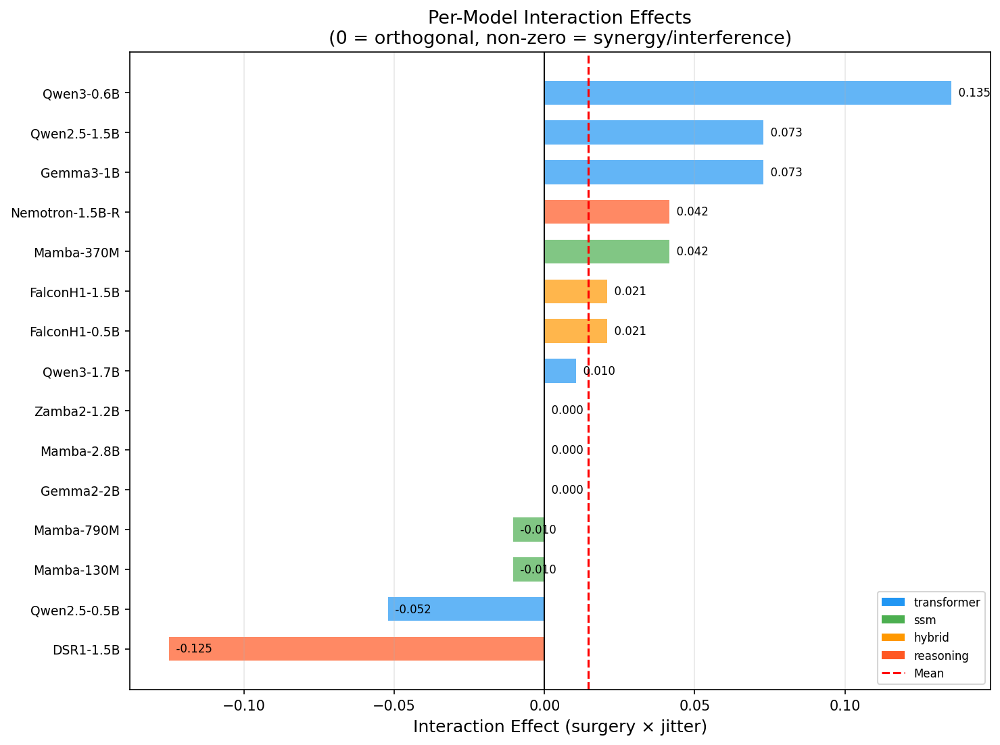
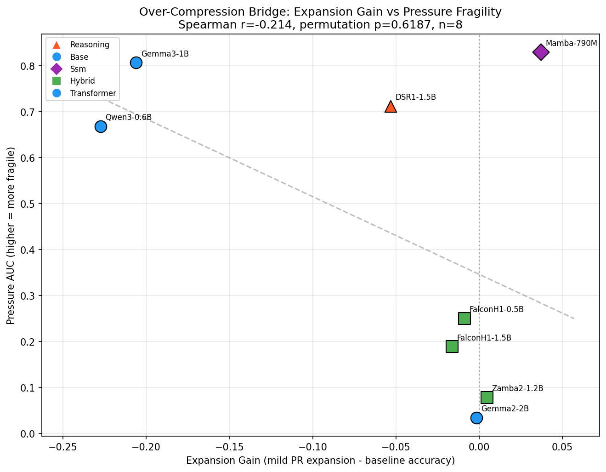

### 6. Ecosystem Convergence
129-model survey reveals architecture convergence (index doubled from 0.23 to 0.49), with 59% of the hybrid adoption penalty explained by a measured compatibility tax (p<0.001).

## Experiment Ledger

| ID | Date | Question | Evidence | Key Result |
|---|---|---|---|---|
| exp-001 | 2026-02-17 | Cross-architecture representation geometry | Causal | 5.3x SSM/Transformer PR gap |
| exp-002 | 2026-02-18 | Bootstrap robustness validation | Confirmatory | Holds under 200 resamples |
| exp-003 | 2026-02-19 | Reasoning activation divergence | Exploratory | DSR1 diverges in early layers only |
| exp-004 | 2026-02-20 | Universal reasoning compression | Causal | 6/6 pairs compress (p=0.016) |
| exp-005 | 2026-02-21 | Causal PR intervention | Causal | Over-compression in DSR1-1.5B |
| exp-006 | 2026-02-22 | Ecosystem analysis (50 models) | Descriptive | 40% show SSM signals |
| exp-007 | 2026-02-23 | Deep ecosystem dynamics (129 models) | Descriptive | Convergence index doubled |
| exp-008 | 2026-02-24 | Compatibility tax mediation | Causal | 59% mediated (p<0.001) |
| exp-009 | 2026-02-25 | Temporal causal analysis | Causal | IV F=23.27, strong instrument |
| exp-010 | 2026-03-05 | Jitter-Pressure Inference Stability | Causal | Hybrids most robust, math fragile |
| exp-011 | 2026-03-05 | Over-compression + JPIS bridge | Causal | Orthogonal axes (r=0.905 vs p=0.61) |
| exp-012 | 2026-03-05 | Mechanistic orthogonality decomposition | Causal | No interaction (OR=1.10, ROPE=0.998) |
| exp-013 | 2026-03-05 | Expanded 3×3 factorial grid | Causal | Orthogonality robust (OR=1.02, 46,656 trials) |
| exp-014 | 2026-03-05 | 7B+ scale validation | Causal | **INTERACTION DETECTED** (OR=0.92, p=0.013) |
| exp-015 | 2026-03-06 | Cross-paradigm resolution | Causal | Transformer-specific coupling (-0.023 vs 0.000) |
| exp-016 | 2026-03-06 | Layerwise coupling mechanism | Causal | **IN PROGRESS** — 32K trials + geometry |

Full details: [`experiments/EXPERIMENTS.md`](experiments/EXPERIMENTS.md)

## Figure Gallery

### Representation Geometry
| | |
|---|---|
| 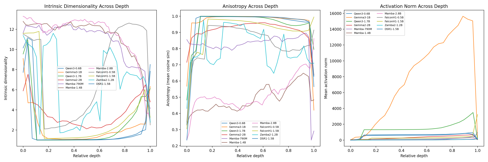 |  |
| Layer-wise PR, anisotropy, CKA across 11 models | Paradigm-level geometry comparison |

### Dynamic Stability (JPIS)
| | |
|---|---|
|  | 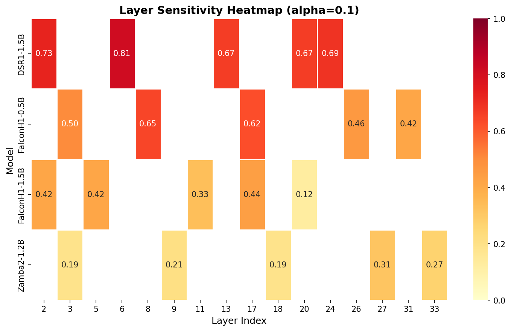 |
| Dose-response curves under perturbation | Layer-wise sensitivity heatmap |

### Over-Compression Bridge
| | |
|---|---|
|  | 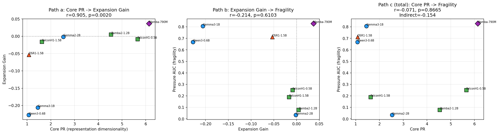 |
| Expansion gain vs pressure fragility | Three-panel mediation path analysis |

### Mechanistic Orthogonality (Exp-012)
| | |
|---|---|
|  | 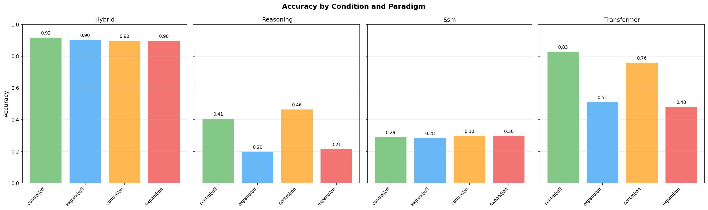 |
| Per-model interaction effects (centered on zero) | Accuracy by condition across paradigms |

### Ecosystem Dynamics
| | |
|---|---|
| 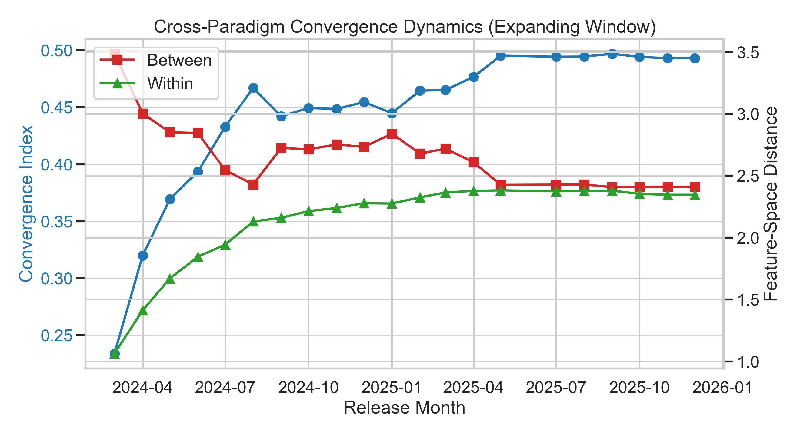 | 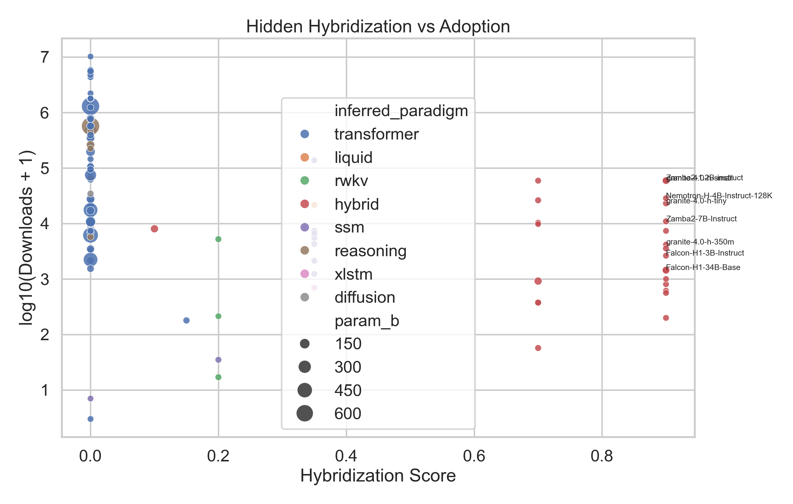 |
| Architecture convergence over time | Hidden hybridization detection |

## Reproducibility

### Requirements
```
torch
transformers
bitsandbytes
scipy
numpy
pandas
matplotlib
seaborn
scikit-learn
statsmodels
```

### Running Experiments
Each experiment has a canonical script in the repo root:
```bash
python representation_geometry.py          # Stage 1: Cross-architecture geometry
python representation_geometry_robustness.py  # Stage 1.5: Bootstrap validation
python reasoning_activation_divergence.py  # Stage 2: Reasoning divergence
python reasoning_pairs_analysis.py         # Stage 2b: Matched pairs
python causal_pr_intervention.py           # Stage 3: Causal PR intervention
python causal_pr_robust.py --stage all     # Stage 3b: Over-compression + bridge
python jitter_pressure_analysis.py         # Stage 4: JPIS stability
python mechanistic_orthogonality_decomposition.py --stage all  # Exp-012: Factorial
python orthogonality_grid_013.py --stage all                  # Exp-013: 3×3 grid
python orthogonality_scale_014.py --stage all                 # Exp-014: 7B+ scale
python orthogonality_cross_paradigm_015.py --stage all        # Exp-015: Cross-paradigm
python orthogonality_mechanism_016.py --stage all             # Exp-016: Layerwise mechanism
```

### Analysis Standards
```bash
python analysis_standards.py init --analysis-dir analysis/<name> --analysis-id <id> --title "<title>" --track dual --owner <owner>
python analysis_standards.py validate --analysis-dir analysis/<name>
python analysis_standards.py score --analysis-dir analysis/<name> --apply-gate-penalty
```

## Data & Lineage

- **Model registry**: 129 models across 8 paradigms (Transformer, SSM, Hybrid, RWKV, xLSTM, Reasoning, MoE, Custom)
- **Activation data**: Generated via NF4 quantization on RTX 5090 Laptop (25.7GB VRAM)
- **All models sourced from HuggingFace Hub** with verified model IDs
- **Registry files**: `verified_models.json`, `model_registry_2026.py`

## Known Limitations

- Sample sizes are small (8-11 models per activation study) — patterns are consistent but N is limited
- JPIS paradigm-level claim (Kruskal-Wallis p=0.113) is descriptive, not statistically robust
- Mamba-1.4B hangs with forward hooks (sequential SSM fallback), RWKV7 requires triton
- No out-of-sample validation for JPIS or bridge analyses
- Sub-3B findings validated at 7B+ for orthogonality (exp-013→014→015→016)
- SSM/hybrid paradigms at 7B+ could not be tested (HuggingFace download failures)

## Project Structure

```
.
├── README.md                          # This file
├── CLAUDE.md                          # Agent operating guide
├── AGENTS.md                          # Agent policy
├── experiments/
│   ├── EXPERIMENTS.md                 # Experiment log (reverse chronological)
│   └── ledger.jsonl                   # Machine-readable experiment ledger
├── analysis/
│   ├── portfolio_scoreboard.csv       # Analysis quality scores
│   ├── representation_geometry/       # Stage 1: Cross-architecture geometry
│   ├── representation_geometry_robustness/  # Stage 1.5: Bootstrap validation
│   ├── reasoning_activation_divergence/     # Stage 2: Reasoning divergence
│   ├── reasoning_pairs/              # Stage 2b: Matched pairs
│   ├── causal_pr_intervention/       # Stage 3: Causal PR intervention
│   ├── causal_pr_robust/             # Stage 3b: Over-compression + bridge
│   ├── jitter_pressure/              # Stage 4: JPIS stability
│   ├── orthogonality_decomposition_012/  # Exp-012: 2×2 factorial
│   ├── orthogonality_grid_013/       # Exp-013: 3×3 factorial grid
│   ├── orthogonality_scale_014/      # Exp-014: 7B+ scale validation
│   ├── orthogonality_cross_paradigm_015/ # Exp-015: Cross-paradigm
│   ├── orthogonality_mechanism_016/  # Exp-016: Layerwise mechanism
│   ├── ecosystem/                    # Ecosystem survey (v1)
│   ├── ecosystem_v2/                 # Ecosystem survey (v2, 129 models)
│   ├── ecosystem_deep/               # Deep dynamics (v1)
│   ├── ecosystem_deep_v2/            # Deep dynamics (v2, 129 models)
│   ├── measured_tax/                 # Compatibility tax (v1)
│   ├── measured_tax_v2/              # Compatibility tax (v2, 129 models)
│   ├── temporal_causal/              # Temporal causal analysis
│   └── temporal_causal_relaxed/      # Temporal causal (relaxed criteria)
└── standards/                         # Analysis quality templates
```
